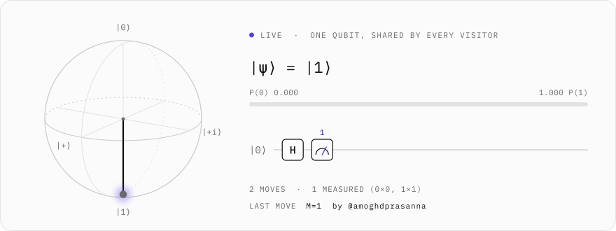
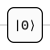

<picture>
  <source media="(prefers-color-scheme: dark)" srcset="assets/banner-dark.svg">
  
</picture>

I'm a graduate researcher at the University of Maryland, working with Prof. Shabnam Jabeen and, at Fermilab's SQMS center, Dr. Tanay Roy. I care about the gap between the circuit we write and what the hardware actually does.

This page is not a résumé. It says why each repository here exists: the question, or the small annoyance, that made the code worth writing.

<a href="https://amogh-d-prasanna.github.io/amogh-d-prasanna/"><picture><source media="(prefers-color-scheme: dark)" srcset="assets/btn-website-dark.svg"></picture></a>&nbsp;
<a href="https://www.linkedin.com/in/amogh-d-p"><picture><source media="(prefers-color-scheme: dark)" srcset="assets/btn-linkedin-dark.svg"></picture></a>&nbsp;
<a href="mailto:amoghdp@umd.edu"><picture><source media="(prefers-color-scheme: dark)" srcset="assets/btn-email-dark.svg"></picture></a>

 

<picture><source media="(prefers-color-scheme: dark)" srcset="assets/hdr-why-dark.svg"></picture>

**Can a quantum circuit learn how quarks become hadrons?** 
`qml_hadronization` &nbsp;·&nbsp; private group repo, write-up in progress &nbsp;·&nbsp; Qiskit, JAX, Pythia 8

There is no first-principles calculation of hadronization, so event generators like Pythia fit a phenomenological string model instead. I train quantum circuit Born machines on Pythia 8 momentum distributions and check what survives once IBM's noise model is switched on. The lesson so far is that on noisy hardware the budget is two-qubit gates, not depth: my best circuit under FakeBrisbane noise uses only 32 native ECR gates.

**Can I ask about *this* equation without leaving the page?** 
[`marginalia`](https://github.com/amoghdprasanna/marginalia) &nbsp;·&nbsp; Python, Qt, Claude API

I read papers and watch lectures most of the day, and every question used to mean copying an equation into another window. marginalia floats over the screen: ask about whatever you're looking at, and markers fly to the symbols the answer is about. The hard part was making them land on the right pixels. It resizes each screenshot itself, so the model's coordinates map one to one onto the image it saw and back to the screen, then snaps each point onto the OCR line it names. Every question is saved to a dated journal of doubts.

**What does a veteran technician know that the manual doesn't?** 
[`HVAC Copilot`](https://github.com/Rayhanpatel/Ycombinator-Cactus-Deepmind) &nbsp;·&nbsp; YC × Cactus × DeepMind hackathon, team project &nbsp;·&nbsp; on-device Gemma

A team-built, on-device voice assistant for HVAC technicians. My part was the search behind it: when the manual's answer doesn't fix the unit, look further, into forums. I wrote a ranker, unit-tested but not yet wired into the app, that lets a certified tech's deeply nested reply outrank the official support page by weighing author expertise, reply depth and "this fixed mine" replies against source authority.

**What does a threat model actually change in the code?** 
[`Threat-Model-Dunder-Mifflin`](https://github.com/amoghdprasanna/Threat-Model-Dunder-Mifflin) &nbsp;·&nbsp; UMD ENPM680 &nbsp;·&nbsp; Go, Fiber, PostgreSQL

A course project that takes a plain inventory app through misuse cases and STRIDE. 29 threats became 38 security requirements, and the code cites 27 of them by ID. The clearest change: a role-tampering threat moved roles out of client-held tokens and into server-side sessions that are reloaded on every request.

**What does ATAK do with a unit that actually moves?** 
[`ATAK-CDCL`](https://github.com/amoghdprasanna/ATAK-CDCL) &nbsp;·&nbsp; Java, Android TAK SDK

TAK's stock CoT injector only scatters static markers. I added a simulated GPS unit that drives line, circle and square paths at a set speed and is sent through ATAK's internal dispatcher, so the map treats it like a real GPS-reported friendly unit and draws its trace.

 

<picture><source media="(prefers-color-scheme: dark)" srcset="assets/hdr-now-dark.svg"></picture>

**Can a learned compiler beat analytic decompositions on a qudit?** With Dr. Tanay Roy (Fermilab SQMS) I'm training models that compile arbitrary SU(*d*) unitaries into native gate sequences for superconducting transmon qudits, with leakage and anharmonicity built into the objective rather than patched on afterwards.

**Decoding topological codes.** I'm contributing to an open-source toolkit, in Python and C++, for simulating and decoding them.

 

<picture><source media="(prefers-color-scheme: dark)" srcset="assets/hdr-qubit-dark.svg"></picture>

Everyone who visits acts on the same qubit: what you apply, what the state becomes, and what you get when you look.

<!-- QUBIT:START -->
<picture><source media="(prefers-color-scheme: dark)" srcset="assets/qubit/card-2-dark.svg"></picture>

<a href="https://github.com/amoghdprasanna/amoghdprasanna/issues/new?title=qubit%3A+H&body=Press+Submit.+A+bot+applies+the+gate+within+a+minute."><picture><source media="(prefers-color-scheme: dark)" srcset="assets/gate-h-dark.svg"></picture></a><a href="https://github.com/amoghdprasanna/amoghdprasanna/issues/new?title=qubit%3A+X&body=Press+Submit.+A+bot+applies+the+gate+within+a+minute."><picture><source media="(prefers-color-scheme: dark)" srcset="assets/gate-x-dark.svg"></picture></a><a href="https://github.com/amoghdprasanna/amoghdprasanna/issues/new?title=qubit%3A+Y&body=Press+Submit.+A+bot+applies+the+gate+within+a+minute."><picture><source media="(prefers-color-scheme: dark)" srcset="assets/gate-y-dark.svg"></picture></a><a href="https://github.com/amoghdprasanna/amoghdprasanna/issues/new?title=qubit%3A+Z&body=Press+Submit.+A+bot+applies+the+gate+within+a+minute."><picture><source media="(prefers-color-scheme: dark)" srcset="assets/gate-z-dark.svg"></picture></a><a href="https://github.com/amoghdprasanna/amoghdprasanna/issues/new?title=qubit%3A+S&body=Press+Submit.+A+bot+applies+the+gate+within+a+minute."><picture><source media="(prefers-color-scheme: dark)" srcset="assets/gate-s-dark.svg"></picture></a><a href="https://github.com/amoghdprasanna/amoghdprasanna/issues/new?title=qubit%3A+T&body=Press+Submit.+A+bot+applies+the+gate+within+a+minute."><picture><source media="(prefers-color-scheme: dark)" srcset="assets/gate-t-dark.svg"></picture></a><a href="https://github.com/amoghdprasanna/amoghdprasanna/issues/new?title=qubit%3A+measure&body=Press+Submit.+A+bot+applies+the+gate+within+a+minute."><picture><source media="(prefers-color-scheme: dark)" srcset="assets/gate-measure-dark.svg"></picture></a><a href="https://github.com/amoghdprasanna/amoghdprasanna/issues/new?title=qubit%3A+reset&body=Press+Submit.+A+bot+applies+the+gate+within+a+minute."><picture><source media="(prefers-color-scheme: dark)" srcset="assets/gate-reset-dark.svg"></picture></a>

Pick a gate. GitHub opens an issue already titled with it; press <b>Submit</b> and a bot applies it within a minute. 
<code>measure</code> samples the Born rule, so the outcome is genuinely random. <a href="https://github.com/amoghdprasanna/amoghdprasanna/issues?q=is%3Aissue+in%3Atitle+%22qubit%3A%22">Every move so far</a>.

<!-- QUBIT:END -->

 

The banner is a tweezer array: atoms load at random, are sorted into a defect-free block, and are entangled by a Rydberg pulse. Everything on this page, including the qubit, is drawn by the code in this repository.
